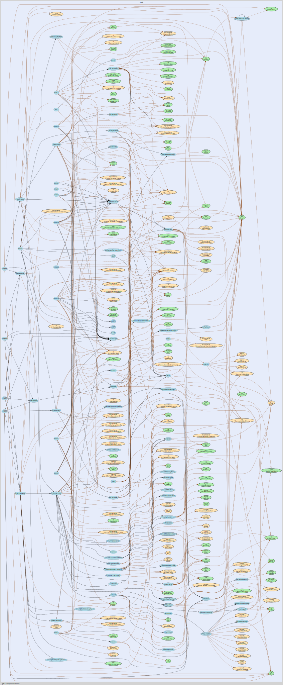

# The process of RUNC CREATE

The steps to create an OCI container with default spec (spec generated with `runc spec`) are as follow:

0. Prerequisites: have $GOPATH set up and runc cloned (with go get) according to its README, have root access, and docker (not necessary if you can find another fs available as rootfs)
1. First compile runc with make (set `BUILDTAG := ''` in the Makefile if the distro/nix environment doesn't support seccomp, I have yet to figure out what seccomp is or how to include it in Nix env).
2. Then compile `contrib/cmd/recvtty/recvtty.go`
3. run `recvtty <socket-path>` to listen on a unix socket which will later be used as TTY entry to the container process.
4. open up another shell, run the following comands:
  ```bash
  mkdir -p mycontainer/rootfs
  cd mycontainer
  runc spec
  docker export $(docker create busybox) | tar -C rootfs -xvf -
  sudo runc create -b . --console-socket <absolute-path-to-socket> cont01
  ```
5. Now we should have a container created, but not running. It is now listening on a fifo located at `/run/runc/cont01/exec.fifo`, waiting for the fifo to be opened. (This can be seen with `htop` then `s` on the runc process)
6. The container state stored at `/run/runc/cont01/state.json` contains the following:
  ```
  {"id":"cont01","init_process_pid":15226,"init_process_start":65894,"created":"2018-07-26T12:08:37.613220873Z","config":{"no_pivot_root":false,"parent_death_signal":0,"rootfs":"/home/vivian/Projects/Emergence/practices/hs-libcontainer/src/godeps/bin/mycontainer/rootfs","readonlyfs":true,"rootPropagation":0,"mounts":[{"source":"/home/vivian/Projects/Emergence/practices/hs-libcontainer/src/godeps/bin/mycontainer/proc","destination":"/proc","device":"proc","flags":0,"propagation_flags":null,"data":"","relabel":"","extensions":0,"premount_cmds":null,"postmount_cmds":null},{"source":"/home/vivian/Projects/Emergence/practices/hs-libcontainer/src/godeps/bin/mycontainer/tmpfs","destination":"/dev","device":"tmpfs","flags":16777218,"propagation_flags":null,"data":"mode=755,size=65536k","relabel":"","extensions":0,"premount_cmds":null,"postmount_cmds":null},{"source":"/home/vivian/Projects/Emergence/practices/hs-libcontainer/src/godeps/bin/mycontainer/devpts","destination":"/dev/pts","device":"devpts","flags":10,"propagation_flags":null,"data":"newinstance,ptmxmode=0666,mode=0620,gid=5","relabel":"","extensions":0,"premount_cmds":null,"postmount_cmds":null},{"source":"/home/vivian/Projects/Emergence/practices/hs-libcontainer/src/godeps/bin/mycontainer/shm","destination":"/dev/shm","device":"tmpfs","flags":14,"propagation_flags":null,"data":"mode=1777,size=65536k","relabel":"","extensions":0,"premount_cmds":null,"postmount_cmds":null},{"source":"/home/vivian/Projects/Emergence/practices/hs-libcontainer/src/godeps/bin/mycontainer/mqueue","destination":"/dev/mqueue","device":"mqueue","flags":14,"propagation_flags":null,"data":"","relabel":"","extensions":0,"premount_cmds":null,"postmount_cmds":null},{"source":"/home/vivian/Projects/Emergence/practices/hs-libcontainer/src/godeps/bin/mycontainer/sysfs","destination":"/sys","device":"sysfs","flags":15,"propagation_flags":null,"data":"","relabel":"","extensions":0,"premount_cmds":null,"postmount_cmds":null},{"source":"/home/vivian/Projects/Emergence/practices/hs-libcontainer/src/godeps/bin/mycontainer/cgroup","destination":"/sys/fs/cgroup","device":"cgroup","flags":2097167,"propagation_flags":null,"data":"","relabel":"","extensions":0,"premount_cmds":null,"postmount_cmds":null}],"devices":[{"type":99,"path":"/dev/null","major":1,"minor":3,"permissions":"","file_mode":438,"uid":0,"gid":0,"allow":false},{"type":99,"path":"/dev/random","major":1,"minor":8,"permissions":"","file_mode":438,"uid":0,"gid":0,"allow":false},{"type":99,"path":"/dev/full","major":1,"minor":7,"permissions":"","file_mode":438,"uid":0,"gid":0,"allow":false},{"type":99,"path":"/dev/tty","major":5,"minor":0,"permissions":"","file_mode":438,"uid":0,"gid":0,"allow":false},{"type":99,"path":"/dev/zero","major":1,"minor":5,"permissions":"","file_mode":438,"uid":0,"gid":0,"allow":false},{"type":99,"path":"/dev/urandom","major":1,"minor":9,"permissions":"","file_mode":438,"uid":0,"gid":0,"allow":false}],"mount_label":"","hostname":"runc","namespaces":[{"type":"NEWPID","path":""},{"type":"NEWNET","path":""},{"type":"NEWIPC","path":""},{"type":"NEWUTS","path":""},{"type":"NEWNS","path":""}],"capabilities":{"Bounding":["CAP_AUDIT_WRITE","CAP_KILL","CAP_NET_BIND_SERVICE"],"Effective":["CAP_AUDIT_WRITE","CAP_KILL","CAP_NET_BIND_SERVICE"],"Inheritable":["CAP_AUDIT_WRITE","CAP_KILL","CAP_NET_BIND_SERVICE"],"Permitted":["CAP_AUDIT_WRITE","CAP_KILL","CAP_NET_BIND_SERVICE"],"Ambient":["CAP_AUDIT_WRITE","CAP_KILL","CAP_NET_BIND_SERVICE"]},"networks":[{"type":"loopback","name":"","bridge":"","mac_address":"","address":"","gateway":"","ipv6_address":"","ipv6_gateway":"","mtu":0,"txqueuelen":0,"host_interface_name":"","hairpin_mode":false}],"routes":null,"cgroups":{"name":"cont01","path":"","scope_prefix":"","Paths":null,"allowed_devices":[{"type":99,"path":"","major":-1,"minor":-1,"permissions":"m","file_mode":0,"uid":0,"gid":0,"allow":true},{"type":98,"path":"","major":-1,"minor":-1,"permissions":"m","file_mode":0,"uid":0,"gid":0,"allow":true},{"type":99,"path":"/dev/null","major":1,"minor":3,"permissions":"rwm","file_mode":0,"uid":0,"gid":0,"allow":true},{"type":99,"path":"/dev/random","major":1,"minor":8,"permissions":"rwm","file_mode":0,"uid":0,"gid":0,"allow":true},{"type":99,"path":"/dev/full","major":1,"minor":7,"permissions":"rwm","file_mode":0,"uid":0,"gid":0,"allow":true},{"type":99,"path":"/dev/tty","major":5,"minor":0,"permissions":"rwm","file_mode":0,"uid":0,"gid":0,"allow":true},{"type":99,"path":"/dev/zero","major":1,"minor":5,"permissions":"rwm","file_mode":0,"uid":0,"gid":0,"allow":true},{"type":99,"path":"/dev/urandom","major":1,"minor":9,"permissions":"rwm","file_mode":0,"uid":0,"gid":0,"allow":true},{"type":99,"path":"/dev/console","major":5,"minor":1,"permissions":"rwm","file_mode":0,"uid":0,"gid":0,"allow":true},{"type":99,"path":"","major":136,"minor":-1,"permissions":"rwm","file_mode":0,"uid":0,"gid":0,"allow":true},{"type":99,"path":"","major":5,"minor":2,"permissions":"rwm","file_mode":0,"uid":0,"gid":0,"allow":true},{"type":99,"path":"","major":10,"minor":200,"permissions":"rwm","file_mode":0,"uid":0,"gid":0,"allow":true}],"devices":[{"type":97,"path":"","major":-1,"minor":-1,"permissions":"rwm","file_mode":0,"uid":0,"gid":0,"allow":false},{"type":99,"path":"","major":-1,"minor":-1,"permissions":"m","file_mode":0,"uid":0,"gid":0,"allow":true},{"type":98,"path":"","major":-1,"minor":-1,"permissions":"m","file_mode":0,"uid":0,"gid":0,"allow":true},{"type":99,"path":"/dev/null","major":1,"minor":3,"permissions":"rwm","file_mode":0,"uid":0,"gid":0,"allow":true},{"type":99,"path":"/dev/random","major":1,"minor":8,"permissions":"rwm","file_mode":0,"uid":0,"gid":0,"allow":true},{"type":99,"path":"/dev/full","major":1,"minor":7,"permissions":"rwm","file_mode":0,"uid":0,"gid":0,"allow":true},{"type":99,"path":"/dev/tty","major":5,"minor":0,"permissions":"rwm","file_mode":0,"uid":0,"gid":0,"allow":true},{"type":99,"path":"/dev/zero","major":1,"minor":5,"permissions":"rwm","file_mode":0,"uid":0,"gid":0,"allow":true},{"type":99,"path":"/dev/urandom","major":1,"minor":9,"permissions":"rwm","file_mode":0,"uid":0,"gid":0,"allow":true},{"type":99,"path":"/dev/console","major":5,"minor":1,"permissions":"rwm","file_mode":0,"uid":0,"gid":0,"allow":true},{"type":99,"path":"","major":136,"minor":-1,"permissions":"rwm","file_mode":0,"uid":0,"gid":0,"allow":true},{"type":99,"path":"","major":5,"minor":2,"permissions":"rwm","file_mode":0,"uid":0,"gid":0,"allow":true},{"type":99,"path":"","major":10,"minor":200,"permissions":"rwm","file_mode":0,"uid":0,"gid":0,"allow":true}],"memory":0,"memory_reservation":0,"memory_swap":0,"kernel_memory":0,"kernel_memory_tcp":0,"cpu_shares":0,"cpu_quota":0,"cpu_period":0,"cpu_rt_quota":0,"cpu_rt_period":0,"cpuset_cpus":"","cpuset_mems":"","pids_limit":0,"blkio_weight":0,"blkio_leaf_weight":0,"blkio_weight_device":null,"blkio_throttle_read_bps_device":null,"blkio_throttle_write_bps_device":null,"blkio_throttle_read_iops_device":null,"blkio_throttle_write_iops_device":null,"freezer":"","hugetlb_limit":null,"oom_kill_disable":false,"memory_swappiness":null,"net_prio_ifpriomap":null,"net_cls_classid_u":0},"uid_mappings":null,"gid_mappings":null,"mask_paths":["/proc/kcore","/proc/latency_stats","/proc/timer_list","/proc/timer_stats","/proc/sched_debug","/sys/firmware","/proc/scsi"],"readonly_paths":["/proc/asound","/proc/bus","/proc/fs","/proc/irq","/proc/sys","/proc/sysrq-trigger"],"sysctl":null,"seccomp":null,"Hooks":{"poststart":null,"poststop":null,"prestart":null},"version":"1.0.0","labels":["bundle=/home/vivian/Projects/Emergence/practices/hs-libcontainer/src/godeps/bin/mycontainer"],"no_new_keyring":false,"rootless":false},"rootless":false,"cgroup_paths":{"blkio":"/sys/fs/cgroup/blkio/user.slice/cont01","cpu":"/sys/fs/cgroup/cpu,cpuacct/user.slice/cont01","cpuacct":"/sys/fs/cgroup/cpu,cpuacct/user.slice/cont01","cpuset":"/sys/fs/cgroup/cpuset/cont01","devices":"/sys/fs/cgroup/devices/user.slice/cont01","freezer":"/sys/fs/cgroup/freezer/cont01","memory":"/sys/fs/cgroup/memory/user.slice/cont01","name=systemd":"/sys/fs/cgroup/systemd/user.slice/user-1002.slice/session-2.scope/cont01","net_cls":"/sys/fs/cgroup/net_cls,net_prio/cont01","net_prio":"/sys/fs/cgroup/net_cls,net_prio/cont01","pids":"/sys/fs/cgroup/pids/user.slice/user-1002.slice/session-2.scope/cont01"},"namespace_paths":{"NEWIPC":"/proc/15226/ns/ipc","NEWNET":"/proc/15226/ns/net","NEWNS":"/proc/15226/ns/mnt","NEWPID":"/proc/15226/ns/pid","NEWUSER":"/proc/15226/ns/user","NEWUTS":"/proc/15226/ns/uts"},"external_descriptors":["/dev/null","/dev/null","/dev/null"],"intel_rdt_path":""}
  ```
8. Now if we want to execute the process as specified in the default spec `sh`. Do `runc start cont01`, which opens the fifo file and the container process will `Exec` into the specified process. The shell we opened earlier will be connected to `sh`.

Now let's talk about what runc is doing in the background:

When `runc create` is ran, the CLI tools calls the action function in `create.go` located at the root level (similar to any other commands), and it loads everything in `Context` (urfave cli specific struct) to `container`, which is defined within libconatiner, and contains all container specific information used to call runc and `config.json`. Specifically, `config.json` is parsed into the `Spec` struct defined at `github.com/opencontainers/runtime-spec/specs-go/config.go`.

After the container is created with all information contained. It is time for the core of the `CREATE` operation.


1. The following environment variables will be set:
  ```sh
  # The child end pipefd mentioned earlier
  _LIBCONTAINER_INITPIPE
  # exec.fifo fd used to signal runc start
  _LIBCONTAINER_FIFOFD
  # Console socket fd
  _LIBCONTAINER_CONSOLE
  # init type set to 'standard'
  _LIBCONTAINER_INITTYPE
  ```
1. First runc creates a child process (via `fork`) called `parent`, which is a bit cofusing but it kind of makes sense later on.
2. The parent process execs the binary at `/proc/self/exe` with arguments [`<cwd>/<current-binary>`, `init`]. The first argument is often an absolute path to the runc binary at where you execute it, I put it that way because it changes if you simply change the name of runc, but for simplicity I will refer to this new program `runc init`. The fact that the parent process executes `/proc/self/exe` ensures that any binary changes after the execution of the current program is not going to effect `runc init` too.
3. Before the fork happened, a pipe is initalised for `runc create` and `runc init` to communicate with each other. They used the pipe to exchange all container specific information that we parsed earlier, using a JSON encode/decoder (which introduces some overhead compared to struct serialisation).
4. `runc init` clears all environment variables.
5. `runc init` now starts to configure the environment of the container according to the passed information. This includes:
  - session keyring
  - network
  - routes
  - selinux labels
  - devices, mount points, filesystems
  - set up console
  - hostname
  - app armor profile
  - apply process labels
  - write sysctl key
  - readonly paths
  - mask path
  - get parent death signal
  - set no new privileges
7. `runc init` then tells the parent that it is ready to execv, which involves in sending another JSON file through the pipe.
8. Then we run initSeccomp, seccomp is priviledged operation and should be ran right before execv and dropping capabilities.
9. Check if the parent is still alive, if it is then we are good, if it died then we kill ourselves.
10. Finally we close the pipe and let the parent finalise its works, (clean up and output errors if necessary).
11. And finally, `runc init` will close the pipe and listen on `fifo_fd`, which will be opened by `runc start cont01` to signal the start operation. Which will trigger another Exec, finally executing the entrypoint of the container.


Here's the runc call graph, probably too complicated to understand but anyway:


